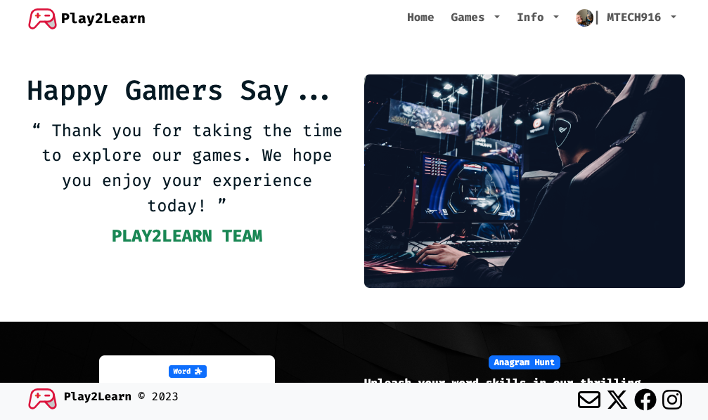

# Play2Learn

Play2Learn is your gateway to an exciting world of interactive learning through video games. We've reimagined education, blending the thrill of gaming with the enrichment of knowledge. Step into a universe where learning feels like playing.



## Project setup

This website is built with [Django](https://www.djangoproject.com/download/) and [Vue](https://vuejs.org/guide/quick-start.html). It uses [Bootstrap](https://getbootstrap.com/docs/5.3/getting-started/download/) for most of the primary layout and styling along with [Font Awesome](https://fontawesome.com/docs) for some icons.

In order to properly test this website, you need to have [python3](https://www.python.org/downloads/) installed and run:

```
python -m venv .venv
```

This will create a virtual environment, now run:

```
(Windows) .venv/Scripts/activate
or
(Mac/Linux) source .venv/bin/activate
```

This will activate your virtual environment where you can store the required packages to interact with this website. Now you should be able to run:

```
pip install -r requirements.txt
```

Next, you will need to set up Vue, in your terminal access vue-games within your .venv once again and run:

```
npm install
```

### Database setup

This website is set up using [PostgreSQL](https://www.postgresql.org/download/), in order for the backend database to function properly:

```
Go to play2learn/settings.py,
Line 104: update the DATABASES key values.
```

\*Make sure to create the necessary database within your PostgreSQL pgAdmin or via the terminal.

Alternatively, if you prefer to use SQLite, you can update the database key values:

```
"ENGINE": "django.db.backends.sqlite3",
"NAME": BASE_DIR / "db.sqlite3",
```

#### Migrate your Database

Finalize database setup and run:

```
python manage.py migrate
```

### SendGrid Email setup

We use SendGrid for automated emails to the Gamer Admin, update from play2learn/settings.py:

```
Line 122: DEFAULT_FROM_EMAIL
```

Additionally, navigate to play2learn/local_settings.py:

```
SENDGRID_API_KEY: Update to your API KEY
```

### Fixtures

I have created about 15 users with several game scores and reviews, along with an Admin group with specified Admin access. There is a small amount of setup here as well. Navigate to fixtures/fixture_gamer_data.json:

```
Under: "model": "account.emailaddress"
Line 703: Update to your email
Line 713: Update to your email

Under: "model": "users.customuser"
Line 1813: Update to your email
Line 1833: Update to your email
```

Next, you will need to load the data into your database. To do that run:

```
python manage.py loaddata fixtures/fixture_gamer_data.json
```

Now you should have some content to play around with as your explore and test out the website.

#### NOTE: All passwords for fixture_gamer_data.json

```
Account Passwords: DjangoP@$$
```

### Compiles and hot-reloads for development

Make sure your .venv is still activated and from the terminal:

```
(.venv) Play2Learn.com => python manage.py runserver
(.venv) vue-games => npm run serve
```

This will launch the backend and front-end local servers. Now I hope you enjoy website. Thanks for playing!
